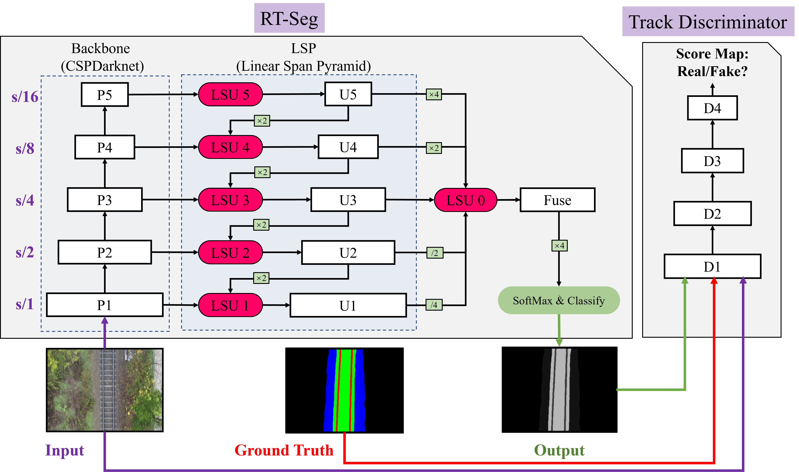
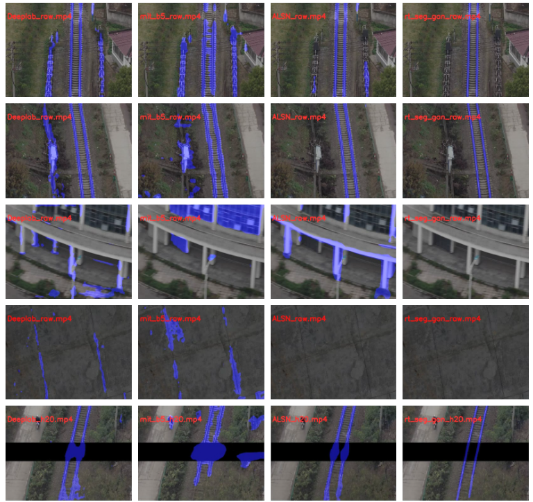

# RTGAN

# pytorch-DFR


### TODO
- [x] Support different backbones
- [x] Multi-GPU training


| Backbone  | Encoder  |IoU(Aug.)  |IOU(no Aug.)| fps |
| :-------- | :------------: |:---------: |:--------------:|:--------------:|
| ResNet    | Vgg16          | 0.6871    |0.8098 | 32.8 |
| PSPNet | Cspdarknet53          | 0.5598    | 0.6937 | 42.99|
| Deeplabv3+       | Xception          | 0.6169    | 0.7884 | 30.08 |
| ALSN  | Cspdarknet53          | 0.6962   | 0.7974 | 35.0 |
| SETR_MLA  | Vit-large          | 0.4301    | 0.5583 | 11.3 |
| SETR_PUP  | Vit-large         | 0.5632    | 0.7652 | 10.7 |
| Segformer  | Mit_b2          | 0.5086    | 0.7017 | 46.0 |
| Segformer | Mit_b5         | 0.5079    | 0.7113 | 15.9 |
| RT-seg(ours) | Cspdarknet53         | 0.7177    | 0.8463 | 34.7 |
| RT-GAN(ours) | Cspdarknet53         | 0.8134    | 0.8807 | 34.7 |


### Introduction
This is a PyTorch(0.4.1) implementation of DFR. 






### Installation
The code was tested with Anaconda and Python 3.6. After installing the Anaconda environment:

0. Clone the repo:
    ```Shell
    git clone https://github.com/ksws0499733/RTGAN.git
    cd DFR
    ```

1. Install dependencies:

    For PyTorch dependency, see [pytorch.org](https://pytorch.org/) for more details.

    For custom dependencies:
    ```Shell
    pip install matplotlib pillow tensorboardX tqdm
    ```
### Training
Follow steps below to train your model:

0. Configure your dataset path in [mypath.py](https://github.com/ksws0499733/RTGAN/blob/master/mypath.py).

The dataset can be download in [baiduCloud](https://pan.baidu.com/s/1zTQU_rilu4I_klvCgxi70Q) (Extraction code: 69jq).

1. Input arguments: (see full input arguments via python train.py --help):
    ```Shell
    usage: python rsn_main.py   \
            --backbone=csp \
            --neck=LSN \
            --dataset=iRailway \
            --batch-size=16 \
            --epochs=80 \
            --loss-type=ce \
            --dataAug=dig,shadow,affine \
            --testPath=doc/test_data/ \
            --dataRepeat=1 \
            --trainRepeat=1 \
            --test-interval=10
          
          python rsn_main_gan.py \
            --backbone=csp \
            --neck=LSN \
            --dataset=iRailway \
            --batch-size=16 \
            --epochs=80 \
            --loss-type=bce \
            --dataAug=dig,shadow,affine \
            --testPath=doc/test_data/ \
            --dataRepeat=1 \
            --trainRepeat=1 \
            --test-interval=10 \
            --generator-model=run/iRailway/csp-LSN-ce-iRailway-dr1/experiment_0/best_model.pth 
    


### Acknowledgement
[PyTorch-Encoding](https://github.com/zhanghang1989/PyTorch-Encoding)

[Synchronized-BatchNorm-PyTorch](https://github.com/vacancy/Synchronized-BatchNorm-PyTorch)

[drn](https://github.com/fyu/drn)

[CBAM](https://github.com/elbuco1/CBAM)

[pytorch-deeplab-xception](https://github.com/jfzhang95/pytorch-deeplab-xception/)

[yolov5](https://github.com/ultralytics/yolov5)
